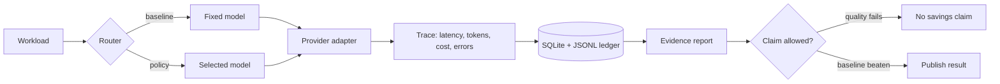

# Cost-Optimized Inference


A small LLM inference gateway for proving whether a routing policy actually improves
cost, latency, or quality.

The project is intentionally narrow: send real provider requests, capture usage,
route with explainable policies, and export evidence that can be reproduced.



## Why This Exists

Most LLM routing demos make the answer look obvious: cheaper model, lower cost,
same quality. That is usually not proven.

This repo treats routing as an experiment. Every optimization needs:

- a baseline;
- real provider usage;
- latency and retry behavior;
- cost accounting from pricing data;
- quality checks good enough to reject bad savings.

## Implemented

| Area | Current state |
| --- | --- |
| Provider path | OpenAI-compatible live calls with timeout, retry, cancellation, and normalized errors |
| Models | FreeModel pricing entries for `gpt-5.5`, `gpt-5.4`, `gpt-5.4-mini`, `gpt-5.3-codex` |
| API | FastAPI `/v1/inference` backed by the real provider adapter |
| Routing | `single_model`, `rule_based`, and policy routing with reason codes |
| Evidence | JSONL request ledger, SQLite benchmark ledger, deterministic evals, JSON/Markdown exports |
| Gates | `ruff`, `mypy`, `pytest`, plus credential-gated provider integration test |

## Not Claimed

- Production readiness.
- Cost savings without a committed benchmark report.
- Semantic quality parity across broad tasks.
- Large-scale infrastructure that has not been justified by local evidence.

## Quick Start

```bash
python3 -m venv .venv
.venv/bin/python -m pip install -e ".[dev,providers]"
make check
```

For live calls, create `.env` locally:

```bash
OPENAI_BASE_URL=https://api.freemodel.dev/v1
OPENAI_API_KEY=your_key_here
OPENAI_TEST_MODEL=gpt-5.4-mini
```

`.env` is ignored by git.

## Run A Real Smoke Call

```bash
set -a; source .env; set +a

.venv/bin/python -m inference_engine.cli \
  --provider openai \
  --model gpt-5.4-mini \
  --prompt "Reply with exactly: ok" \
  --max-tokens 8 \
  --temperature 0
```

## Run A Benchmark

```bash
set -a; source .env; set +a

.venv/bin/python scripts/run_benchmark.py run \
  --workload benchmarks/workloads/smoke.jsonl \
  --strategy single_model \
  --model gpt-5.4-mini \
  --max-estimated-cost-usd 0.01 \
  --run-id baseline-gpt-5-4-mini

.venv/bin/python scripts/run_benchmark.py export \
  --run-id baseline-gpt-5-4-mini \
  --format both
```

## Current Evidence

Live FreeModel validation has confirmed provider connectivity, usage metadata,
pricing-based cost calculation, and the credential-gated integration path.

The current smoke workload uses five deterministic JSON-contract tasks. A reviewed
single-model baseline artifact is committed here:

- [Smoke benchmark evidence](./benchmarks/reports/smoke-json-contract-gpt-5-4-mini-20260703.md)

That artifact supports provider-backed smoke readiness. It does not support a cost
savings claim because no optimized candidate run has been compared yet.

## Next Engineering Tasks

1. Run a same-workload baseline-versus-policy comparison and reject it unless quality holds.
2. Add deadline-aware fallback behavior to the router.
3. Feed observed latency profiles back into routing decisions.
4. Expand quality evaluation beyond deterministic JSON contracts.
5. Separate smoke evidence from broader benchmark suites.

## Docs

- [Project Status](./PROJECT_STATUS.md)
- [Strategy Brief](./docs/00_STRATEGY_BRIEF.md)
- [Target Architecture](./docs/01_TARGET_ARCHITECTURE.md)
- [Implementation Roadmap](./docs/02_IMPLEMENTATION_ROADMAP.md)
- [Benchmark And Eval Plan](./docs/03_BENCHMARK_AND_EVAL_PLAN.md)
- [Codex Quality System](./docs/04_CODEX_QUALITY_SYSTEM.md)
